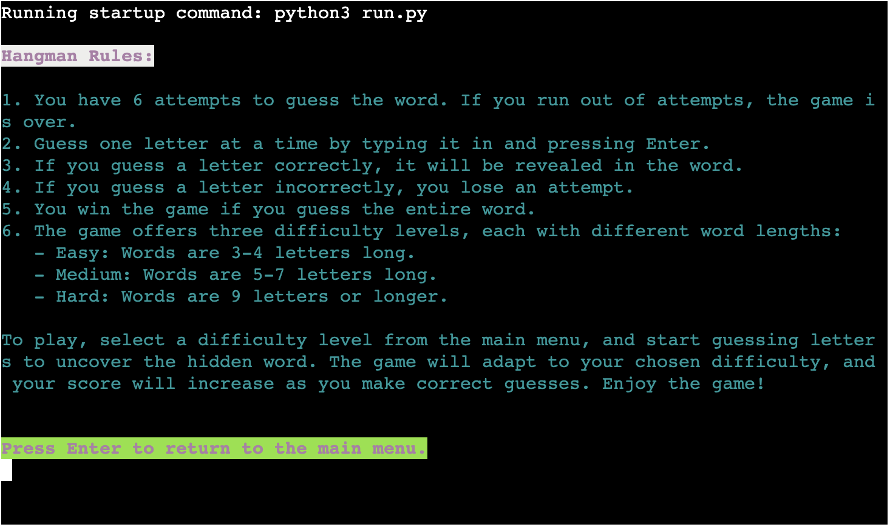
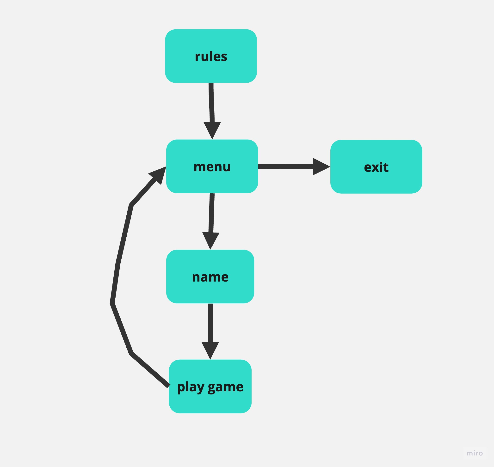

# Hangman

*The link to [Hangman](https://hangmaan-e286c342fa29.herokuapp.com/)*

The Hangman Game is a text-based word guessing game that challenges your word-guessing skills. You can play this game in three different difficulty levels: easy, medium, and hard. The objective of the game is to guess the hidden word letter by letter, while avoiding being "hanged" by incorrect guesses.

---

## How to play:

  1. Click this *[link](https://hangmaan-e286c342fa29.herokuapp.com/)* or copy this text: `https://hangmaan-e286c342fa29.herokuapp.com/` and paste it in your browser's address bar.
  1. Once the game page is loaded, click the "RUN PROGRAM" button.
  1. Introduce yourself to the program by entering your name when prompted.
  1. Familiarize yourself with the game rules, which will be displayed. Take a moment to read through them.
  1. Start playing by selecting one of the three difficulty levels: Easy, Medium, or Hard.
  1. In the game, type individual letters to guess the hidden word. Press Enter after each guess.
  1. As you make correct guesses, the word will be gradually revealed. Keep an eye on your score, which increases with each correct guess.
  1. Enjoy the game and you progress through the game. 
  Press Enter to continue through the story.
  1. If you want to play another round with different words or at a different difficulty level, simply select your choice from the main menu.
  1. Once you've had your fill of the game, you can choose the "Quit" option from the main menu to exit the game.

  Link to the game: *https://hangmaan-e286c342fa29.herokuapp.com/*

---
## User Stories
### First Time Visitor Goals:

* As a First Time Visitor, I want to quickly understand the Hangman game's primary purpose so that I can learn more about how to play it.
* As a First Time Visitor, I want to navigate through the game easily so that I can find the content and start playing without confusion.
* As a First Time Visitor, I want to find the game useful and engaging so that I can enjoy my first experience and have fun.
* As a First Time Visitor, I want to see different text colors to make the game visually appealing and easy to follow.

### Frequent Visitor Goals:
* As a Hangman Player, I want to enjoy a challenging and enjoyable gaming experience.
* As a Hangman Player, I expect the text in the game to be legible at all times for a smooth gaming experience.

---

## Features

 - **1. Multiple Difficulty Levels**
 * Play the game at different difficulty levels: Easy, Medium, and Hard.
 * Each difficulty level features words of varying lengths, making the game accessible to players of all skill levels.

 - **Hangman Art**
- Enjoy visually appealing Hangman art that changes with each incorrect guess, adding to the suspense and challenge of the game.

 - **Player Customization**
- Customize your player name to make the game more personalized and engaging.

 - **Google Sheets Integration**
- Automatically update your game scores in a Google Sheet to keep track of your progress over time.

 - **Rules Explanation**
- Get a clear understanding of the game rules with a built-in option to view the rules before starting to play.

 - **Word Lists**
- Access an extensive word bank for each difficulty level, ensuring a wide variety of words for countless gameplay sessions.

 - **Realistic Gameplay**
- Experience a realistic Hangman game with word guessing, incorrect guesses, and the thrill of uncovering the hidden word.

 - **Interactive Menus**
- User-friendly menus for easy navigation between gameplay, rules, and exiting the game.

 - **Colorful Interface**
- Enjoy a colorful and visually appealing interface that enhances the gaming experience.

 - **Score Tracking**
- Earn points with each correct guess and keep track of your current score throughout the game.

 - **Quitting Option**
- Choose to quit the game at any time or see it through to the end.

 - **Clearing the Screen**
- Ensure a clean and clear game interface with an option to clear the screen when needed.

---

## Hangman Game - How to Play

### Step 1: Game Introduction and Rules

1. When you run the Hangman game, you will be greeted with a game introduction and a brief explanation of the rules. The game sets the stage for an exciting word-guessing adventure.

   

### Step 2: Choose a Difficulty Level

2. After familiarizing yourself with the game introduction and rules, you will be presented with the option to choose a difficulty level:

   - **Easy**: Suitable for beginners with shorter words.
   - **Medium**: A moderate challenge with longer words.
   - **Hard**: For experts, featuring the most challenging and lengthy words.

   

### Step 3: Enter Your Name

3. Following your difficulty level selection, you will be prompted to enter your name. Your name will be used to personalize your gaming experience and track your scores.

   

### Step 4: Start Playing

4. Once you've entered your name, the game will begin. You will see a blank word waiting to be revealed. Your goal is to guess the entire word before running out of attempts.

   - **Game Display**: The game provides a user-friendly display with the following information:
     - The Hangman art, showing your progress and the number of attempts left.
     - The current state of the word with guessed letters revealed.
     - A list of previously guessed letters.
     - Your player name and current score.

   - **Guessing**: Type a letter and press Enter. If it's correct, the letter will be filled into the word. If it's wrong, you'll lose an attempt.

   - **Winning or Losing**: Your objective is to guess the entire word correctly. If you succeed, you win the game with a cheerful message. If you run out of attempts, the game ends, and you receive a message indicating that you've been "hanged". But you can still continue playing untill you get bored!

   

### Step 5: Quitting the Game

5. If at any point you choose to exit the game, select the "Quit" option. The game will show you menu where you can choose exit and game will bid you farewell with a friendly message, and your session will be concluded.

   
   

---

## Flowchart

The flowchart represents the logic of the game:

  

---
## Technologies Used

### Languages:

- [Python 3.8.5](https://www.python.org/downloads/release/python-385/): used to anchor the project and direct all application behavior

- [JavaScript](https://www.javascript.com/): used to provide the start script needed to run the Code Institute mock terminal in the browser

### Frameworks/Libraries, Programmes and Tools:
#### Python modules/packages:

##### Standard library imports:

- [random](https://docs.python.org/3/library/random.html) was used to implement pseudo-random number generation.
- [os](https://docs.python.org/3/library/os.html ) was used to clear the terminal before running the program.
##### Third-party imports:

- [gspread](https://docs.gspread.org/)  Used to connect and interact with Google Sheets for storing player data.
- [google.oauth2.service_account](https://google-auth.readthedocs.io/) Used for working with service account credentials to authenticate with Google services.
- [Simple Terminal Menu](https://pypi.org/project/simple-term-menu/) was used to implement the menu.
- [Colorama](https://pypi.org/project/colorama/) was used to add colors and styles to the project.

#### External tools:

- [VSCode](https://code.visualstudio.com/) was used as the main tool to write and edit code.
- [Git](https://git-scm.com/) was used for the version control of the website.
- [GitHub](https://github.com/) was used to host the code of the website.
- [Miro](https://miro.com/app/) was used to make a flowchart for the README file.
- [Heroku](https://dashboard.heroku.com/) was used to deploy the project.
- [Google Sheets](https://www.google.com/sheets/) used for storing player names and scores.

---

## Bugs

+ **Solved bugs**

### Bug: Timer Display Issue

- **Description:** Initially, there was an issue where the timer was meant to be updated every second in the terminal, but it was consistently displayed on the same line as the "Guess a letter" prompt. This layout caused confusion and led to various bugs and issues during gameplay.
- **Solution:** To resolve this issue, I decided to remove the timer display altogether. This decision simplified the game interface and removed the source of many bugs, resulting in a cleaner and more user-friendly gaming experience.
 [Timer Bug](documentation/timer_bug.png)

### Bug: Google Sheets Integration Issue

- **Description:** Initially, there were multiple errors and issues related to the Google Sheets integration in the game. These issues prevented the game from functioning as intended, and there were errors in data communication between the game and the Google Sheet.
- **Solution:** To address these integration problems, I conducted a thorough review and reconfiguration of the Google Sheets integration. After identifying and rectifying the issues, I successfully established a connection between the game and the Google Sheet, enabling the storage of player data and scores as intended.
 

+ **Unsolved bugs**

- I hope I don't have unsolved bugs.

---

## Testing

Please refer to the [TESTING.md](TESTING.md) file for all test related documentation.

---

## Deployment

- The program was deployed to [Heroku](https://dashboard.heroku.com).
- The program can be reached by the [link](https://hangmaan-e286c342fa29.herokuapp.com/)

## Local Deployment

To deploy the project locally, follow these steps:

### Prerequisites

- Python must be installed on your local machine. You can install it by running:
  - `sudo apt install python3` 
- Ensure that pip is installed for installing the required modules. If not, install it with:
  - `sudo apt install python3-pip`

### Download or Clone the Project

You can choose to download the project or clone it from the repository.

**Option 1: Download ZIP File**

1. Visit the [GitHub Repository](https://github.com/AnastassiiaBondarenko/hangmaan).
2. Click on the "Code" button and download the ZIP file containing the project.
3. Unzip the downloaded file to a directory of your choice.

**Option 2: Clone the Repository**

1. Open a terminal and navigate to the directory where you want to store the project.
2. Run the following command:
  - ` https://github.com/AnastassiiaBondarenko/hangmaan.git`

### Install Dependencies

1. Navigate to the project folder using the terminal:
  - `cd hangmaan`

2. Install the required Python modules by running:
  - `pip3 install -r requirements.txt`

*Note: If you are in a region with restricted internet access, you may need to configure a proxy for the `nltk` package. Consult your VPN settings for the server address and HTTP/HTTPS Proxy Port.*

## Remote Web Application Deployment

You can deploy the project as a remote web application on platforms like Heroku or Render.

### Heroku Deployment

1. Go to the Deploy tab.

  1. Link your GitHub account and connect the application to the repository you created.

  1. Go to the Settings tab:
  

  1. Click "Add buildpack":

  1. Add the Python and Node.js buildpacks.

  1. Click "Reveal Config Vars."

  1. Add 2 new Config Vars:
      - Key: PORT Value: 8000
      - *This Config was provided by [CODE INSTITUTE](https://codeinstitute.net/)*.
      - Key: CREDS Value: all info from creds.json

  1. Go back to the Deploy tab

  1. Click "Deploy Branch"

      - Wait for the completion of the deployment.

  1. Click "Open app" to launch the application inside a web page.

---
## Credits

- Color formatting: [Colorama](https://pypi.org/project/colorama/).
- Terminal menu: [Simple Terminal Menu](https://pypi.org/project/simple-term-menu/).
- Deployed  with [Heroku](https://www.heroku.com/).
- CI Template Powered by GitHub used for automated testing and workflows.
- [VS Code](https://code.visualstudio.com/) was used for writing the code for this game.

