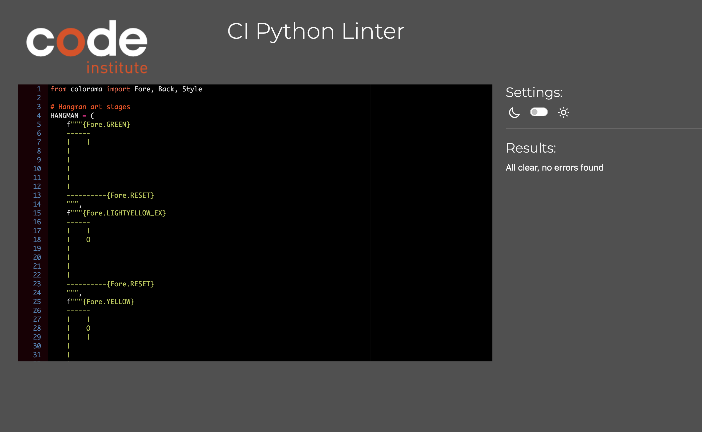
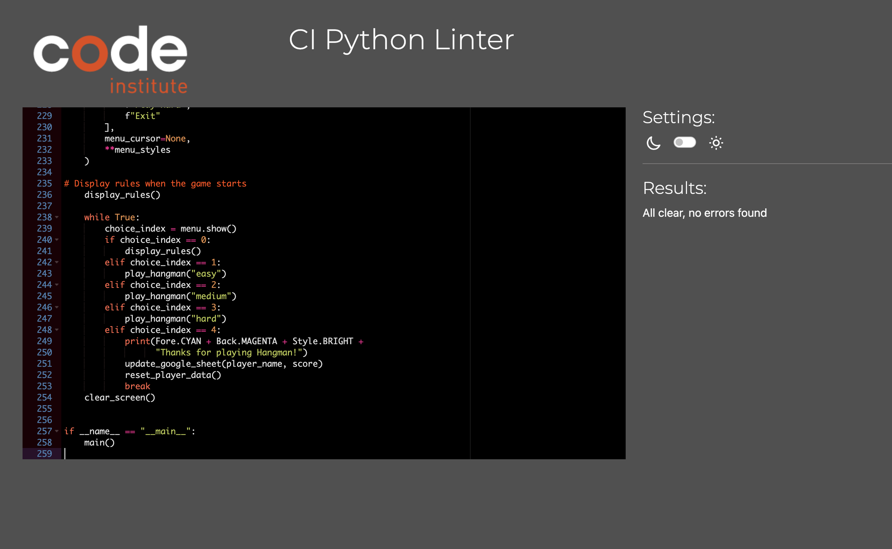

# Testing Results for Hangman Application

## PEP 8 Compliance Testing

I used the [PEP8CI online tool](https://pep8ci.herokuapp.com/) to test my Hangman application for PEP 8 compliance. The tool analyzes the code for adherence to PEP 8 style guide recommendations.

### Test Outcome

I am pleased to report that after running the PEP 8 compliance test, no errors were found in my Hangman application. All code components meet the PEP 8 guidelines, including line length recommendations.

## Conclusion

The Hangman application has successfully passed the PEP 8 compliance test and adheres to the recommended coding standards.
- **constant.py**

- **run.py**

## Manual Testing

In addition to automated testing, I conducted manual testing to ensure the functionality and usability of the Hangman application.

### Test Scenarios

1. **Gameplay Testing**:
    - Tested the core gameplay, including word selection, guesses, and win/lose conditions.
    - Verified that the application accurately evaluates correct and incorrect guesses.
    - Ensured the game ends when a player wins or loses.

2. **User Interface Testing**:
    - Checked the user interface for consistency and clarity.
    - Verified that the colored text formatting worked correctly.
    - Ensured that input prompts and feedback messages were clear and user-friendly.

3. **Input Testing**:
    - Tested different user inputs, including letter guesses and responses to prompts.
    - Checked for any input validation and handling issues.

### Test Results

I'm happy to report that the manual testing process yielded successful results. The Hangman application performed as expected, and all tested scenarios were successful.

## Conclusion

The Hangman application has successfully passed both PEP 8 compliance testing and manual testing. It adheres to coding standards and delivers a user-friendly gaming experience.
